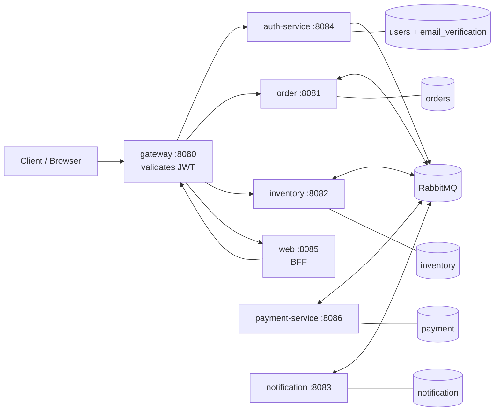

🇧🇷 [Português](./README.md) | 🇺🇸 **English**

# Order Flow

Event-driven distributed order system built to demonstrate **event-driven saga, outbox pattern, idempotency, compensation and DLQ** in Java 21 + Spring Boot on RabbitMQ. The architectural problem it tackles is consistency across autonomous services: each module owns its own Postgres schema and never calls another service synchronously in the business flow.


## Why this project

- **Asynchronous messaging with direct + fanout exchanges**: an order result is propagated to multiple consumers without coupling producer to consumers.
- **Saga with compensation**: inventory is reserved, payment decides, and on rejection a compensation event restores the reserved stock — every step is idempotent.
- **Outbox pattern**: `Order` and `OutboxEvent` are written in the same transaction; a scheduled publisher sends pending rows, eliminating the "order saved, event never published" gap.
- **Consistency under concurrency**: idempotency via `INSERT ... ON CONFLICT DO NOTHING`, optimistic locking (`@Version`) on `Order` and `Inventory`, and DLQ for unrecoverable messages.

## Architecture



| Module | Responsibility |
|---|---|
| `gateway` (:8080) | Single entry point (Spring Cloud Gateway/WebFlux); validates JWT signature/expiration before path-routing. |
| `auth-service` (:8084) | Registration, login, email verification (with resend cooldown) and JWT issuance. |
| `auth-security` | Shared JWT validation/role extraction library. No controller of its own. |
| `order` (:8081) | Creates orders (outbox + `Idempotency-Key`), listens for the result and updates status. |
| `inventory` (:8082) | Reserves/debits stock, starts payment, approves/rejects and compensates reservations. |
| `payment-service` (:8086) | Consumes the payment request, authorizes (idempotent) and publishes result/compensation. |
| `notification` (:8083) | Sends order-result and account-verification emails (idempotent consumer). |
| `web` (:8085) | Thymeleaf session-based BFF; stores the JWT in the `HttpSession` and calls the gateway like any client. |

## Main flow

1. Client creates the order (`POST /orders`) through the gateway; `order` persists `Order` as `PENDING` + `OutboxEvent` in the same transaction.
2. The scheduled `OutboxPublisher` publishes the event to `order.exchange` with routing key `rk.inventory`.
3. `inventory` consumes it, checks idempotency and reserves stock with optimistic locking. Insufficient stock → publishes a rejection to `order.result.exchange`; reservation OK → publishes a payment request to `payment.exchange`.
4. `payment-service` consumes it, checks idempotency and authorizes payment, publishing the result to `order.result.exchange` (fanout).
5. `order` updates the status to `CONFIRMED`/`REJECTED` and `notification` sends the email — both consume the fanout and are idempotent.
6. **Compensation**: if payment rejects, it publishes the negative result and an event to `payment.compensation.exchange`; `inventory` consumes it and restores the reserved quantity idempotently.
7. Messages that fail unrecoverably go to the corresponding DLQ instead of being lost.

## Key patterns

| Pattern | Where it is applied | Why |
|---|---|---|
| Outbox | `order` (`tb_outbox_events` + scheduled publisher) | Atomicity between saving the order and publishing the event. |
| Idempotency (`ON CONFLICT DO NOTHING`) | `order`, `inventory`, `payment`, `notification` | Redelivery of the same message does not duplicate effects. |
| Saga + compensation | `inventory` ↔ `payment` | Undo the stock reservation when payment rejects. |
| Optimistic locking (`@Version`) | `Order` and `Inventory` entities | Prevent lost updates on concurrent operations. |
| DLQ + retry/backoff | every queue; retry configured on the `notification` listener | Avoid losing unrecoverable messages; absorb transient failures. |
| Schema per module + Flyway | all modules | Data isolation and versioned migrations. |
| Defense in depth (JWT) | `gateway` + downstream services via `auth-security` | Token is validated at the edge and again on each service. |
| RBAC | `order` (`GET`), `inventory` (product creation) | Admin endpoints restricted to `ROLE_ADMIN`. |
| Session BFF | `web` | JWT stays server-side (`HttpSession`), never in a cookie/localStorage. |

## Tech stack

- Java 21 · Spring Boot 3.3.5 · Spring Cloud Gateway 2023.0.3
- Spring AMQP (RabbitMQ) · Spring Data JPA · Bean Validation
- PostgreSQL 16 · Flyway · one schema per module
- MapStruct · Lombok
- JWT via jjwt 0.12.6 (`auth-security` module)
- Thymeleaf (`web` only)
- Actuator + Micrometer (Prometheus)
- Testcontainers 2.0.5
- Maven multi-module · Docker · Azure Container Apps · GitHub Actions

## Observability & CI/CD

- Every service exposes `health`, `info` and `prometheus` via Actuator/Micrometer. `monitoring/prometheus.yml` and `docker-compose-monitoring.yml` bring up Prometheus (`:9090`) and Grafana (`:3000`).
- **CI** (`.github/workflows/ci.yml`): `mvn clean verify` on push/PR to `main` and `develop` (Java 21 Temurin, Maven cache).
- **CD** (`.github/workflows/azure-login.yml`): on push to `main`, path-filter detects which modules changed, builds a matrix, builds/pushes the image to ACR and runs `az containerapp update` on Azure Container Apps. Credentials come from GitHub secrets.

## Running locally

Requirements: Docker and Docker Compose.

```bash
cp .env.example .env      # set JWT_SECRET (e.g. openssl rand -base64 48)
docker compose up -d
```

- Gateway: `http://localhost:8080` · Web/BFF: `http://localhost:8085`
- RabbitMQ management: `http://localhost:15672` · Mailpit (dev emails): `http://localhost:8025`
- Observability (optional): `docker compose -f docker-compose-monitoring.yml up -d`

Without `BREVO_API_KEY`, `notification` still starts and development emails can be inspected in Mailpit.

## Project status / next steps

- The payment decision (`PaymentService.authorize`) is deterministic and **always approves** in this version; the rejection/compensation branch is already implemented and tested, awaiting the real rule.
- `monitoring/prometheus.yml` still points to old ports/services (order/inventory/notification on 8080/8081/8082); scrape targets must be aligned with the current ports and the remaining modules.
- Concurrency/idempotency/outbox/compensation tests use Testcontainers.

## Author

Nicolas Emanuel de Sena Cajueiro (Badniko) — [GitHub @DevNic0las](https://github.com/DevNic0las)

MIT License — see [LICENSE](./LICENSE).
