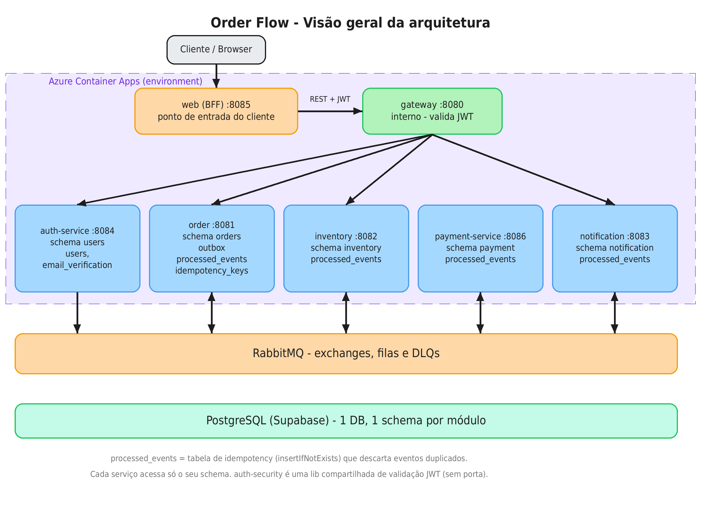
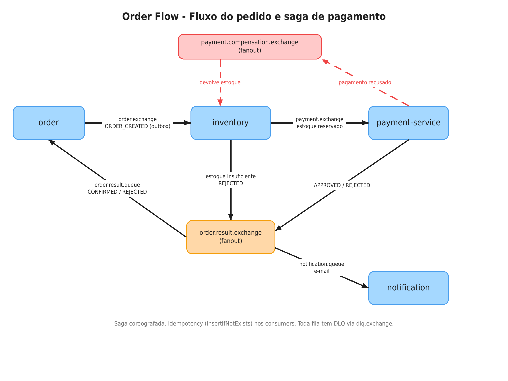

🇧🇷 **Português** | 🇺🇸 [English](./README.en.md)

# Order Flow

Sistema de pedidos distribuído orientado a eventos, construído para demonstrar **saga coreografada, outbox pattern, idempotência, compensação e DLQ** em Java 21 + Spring Boot sobre RabbitMQ. O problema de arquitetura que ele ataca é a consistência entre serviços autônomos: cada módulo tem seu próprio schema Postgres e nunca chama o outro de forma síncrona no fluxo de negócio.


## Why this project

- **Mensageria assíncrona com exchanges direct + fanout**: o resultado de um pedido é propagado a múltiplos consumidores sem acoplamento entre produtor e consumidores.
- **Saga coreografada com compensação**: sem orquestrador central; cada serviço reage a eventos. O estoque é reservado, o pagamento decide e, em caso de recusa, um evento de compensação devolve o estoque reservado — cada etapa é idempotente.
- **Outbox pattern**: `Order` e `OutboxEvent` são gravados na mesma transação; um publisher agendado publica os pendentes, eliminando o caso "pedido salvo, evento nunca publicado".
- **Consistência sob concorrência**: idempotência via `INSERT ... ON CONFLICT DO NOTHING`, optimistic locking (`@Version`) em `Order` e `Inventory`, e DLQ para mensagens não processáveis.

## Architecture

```mermaid
flowchart LR
  Client[Cliente / Browser] --> WEB[web :8085<br/>BFF — ponto de entrada do cliente]
  WEB --> GW[gateway :8080<br/>interno, valida JWT]

  GW --> AUTH[auth-service :8084]
  GW --> ORD[order :8081]
  GW --> INV[inventory :8082]
  GW --> NOT[notification :8083]

  ORD <--> MQ[(RabbitMQ)]
  INV <--> MQ
  PAY[payment-service :8086] <--> MQ
  NOT <--> MQ
  AUTH --> MQ

  subgraph PG["PostgreSQL: 1 database, 1 schema por módulo"]
    DB_ORD[(orders)]
    DB_INV[(inventory)]
    DB_PAY[(payment)]
    DB_NOT[(notification)]
    DB_USR[(users)]
  end

  ORD --- DB_ORD
  INV --- DB_INV
  PAY --- DB_PAY
  NOT --- DB_NOT
  AUTH --- DB_USR
```



| Módulo | Responsabilidade |
|---|---|
| `web` (:8085) | BFF Thymeleaf com sessão; único serviço com ingress externo; guarda o JWT no `HttpSession` e chama o gateway. |
| `gateway` (:8080) | Entrada única dos serviços internos (Spring Cloud Gateway/WebFlux); valida assinatura/expiração do JWT antes de rotear por path. |
| `auth-service` (:8084) | Registro, login, verificação de e-mail (com cooldown de reenvio) e emissão de JWT. |
| `auth-security` | Lib compartilhada de validação de JWT e extração de roles. Sem controller próprio. |
| `order` (:8081) | Cria pedidos (outbox + `Idempotency-Key`), escuta o resultado e atualiza o status. |
| `inventory` (:8082) | Reserva/debita estoque, inicia o pagamento, aprova/rejeita e compensa reservas. |
| `payment-service` (:8086) | Consome o pedido de pagamento, autoriza (idempotente) e publica resultado/compensação. |
| `notification` (:8083) | Envia e-mail de resultado do pedido e de verificação de conta (consumidor idempotente). |

Um único PostgreSQL com um schema por módulo e sem acesso cruzado entre schemas: mantém o isolamento de dados dos microsserviços com custo de infra baixo. Em produção real, o passo natural seria um banco por serviço.

No Azure Container Apps, apenas o web (BFF) tem ingress externo; o gateway e os demais serviços têm ingress interno.

## Main flow


1. O pedido entra pelo `web` (BFF), que chama o `gateway` com `POST /orders` e o header `Idempotency-Key`; o `order` grava `Order` como `PENDING` + `OutboxEvent` na mesma transação.
2. O `OutboxPublisher` (agendado) publica o evento em `order.exchange` com routing key `rk.inventory`.
3. O `inventory` consome, checa idempotência e reserva o estoque com lock otimista. Estoque insuficiente → publica rejeição em `order.result.exchange`; reserva OK → publica pedido de pagamento em `payment.exchange`.
4. O `payment-service` consome, checa idempotência e autoriza o pagamento, publicando o resultado em `order.result.exchange` (fanout).
5. O `order` atualiza o status para `CONFIRMED`/`REJECTED` e o `notification` envia o e-mail — ambos consomem o fanout e são idempotentes.
6. **Compensação**: se o pagamento recusar, ele publica o resultado negativo e um evento em `payment.compensation.exchange`; o `inventory` consome e devolve a quantidade reservada de forma idempotente.
7. Mensagens que falham de forma não recuperável vão para a DLQ correspondente em vez de se perder.

## Key patterns

| Padrão | Onde é aplicado | Por quê |
|---|---|---|
| Outbox | `order` (`tb_outbox_events` + publisher agendado) | Atomicidade entre salvar o pedido e publicar o evento. |
| Idempotency (`ON CONFLICT DO NOTHING`) | Consumers de eventos (`order`, `inventory`, `payment`, `notification`) | Redelivery da mesma mensagem não duplica efeitos. |
| Tabelas de eventos processados | `tb_processed_order_result_events` (`order`), `tb_processed_inventory_events` + `tb_processed_payment_compensation_events` (`inventory`), `tb_processed_payment_events` (`payment`), `tb_processed_notification_events` (`notification`) | Registrar `event_id` de forma atômica para garantir idempotência. |
| Idempotency-Key do `POST /orders` | `order` (`tb_order_idempotency_keys`) + header `Idempotency-Key` | Retry do cliente devolve o mesmo pedido em vez de criar outro. |
| Saga coreografada + compensação | `inventory` ↔ `payment` | Desfazer a reserva de estoque quando o pagamento recusa, sem orquestrador. |
| Optimistic locking (`@Version`) | entidades `Order` e `Inventory` | Evitar perda de update em operações concorrentes. |
| DLQ + retry/backoff | todas as filas; retry configurado no listener de `notification` | Não perder mensagens não processáveis; absorver falhas transientes. |
| Schema per module + Flyway | todos os módulos | Isolamento de dados e migrações versionadas. |
| Defense in depth (JWT) | `gateway` + serviços downstream via `auth-security` | O token é validado na borda e novamente em cada serviço. |
| RBAC | `order` (`GET`), `inventory` (cadastro de produto) | Endpoints admin restritos a `ROLE_ADMIN`. |
| BFF com sessão | `web` | JWT fica no servidor (`HttpSession`), nunca em cookie/localStorage. |

## Tech stack

- Java 21 · Spring Boot 3.3.5 · Spring Cloud Gateway 2023.0.3
- Spring AMQP (RabbitMQ) · Spring Data JPA · Bean Validation
- PostgreSQL 16 · Flyway · um schema por módulo
- MapStruct · Lombok
- JWT via jjwt 0.12.6 (módulo `auth-security`)
- Thymeleaf (apenas `web`)
- Actuator + Micrometer (Prometheus)
- Testcontainers 2.0.5
- Maven multi-módulo · Docker · Azure Container Apps · GitHub Actions

## Observability & CI/CD

- **Observability (local, docker compose)**: cada serviço expõe `health`, `info` e `prometheus` via Actuator/Micrometer. `monitoring/prometheus.yml` faz scrape de `order` (:8081), `inventory` (:8082), `payment-service` (:8086), `notification` (:8083), `auth-service` (:8084) e `gateway` (:8080), com os context-paths corretos; `docker-compose-monitoring.yml` sobe Prometheus (`:9090`) e Grafana (`:3000`). Prometheus e Grafana rodam apenas localmente (docker compose); não estão implantados no Azure Container Apps.
- **CI** (`.github/workflows/ci.yml`): `mvn clean verify` em push/PR para `main` e `develop` (Java 21 Temurin, cache Maven).
- **CD** (`.github/workflows/deploy.yml`): em push para `main`, `dorny/paths-filter` detecta quais módulos mudaram (mudanças em `auth-security` reimplantam os serviços que a consomem; no `pom.xml` raiz, todos) e monta uma matrix; cada serviço alterado é buildado, tem a imagem publicada no ACR com **tag igual ao SHA do commit** (`:<github.sha>`) e recebe `az containerapp update` no Azure Container Apps. O login no Azure usa **OIDC federado** (`azure/login` com `id-token: write` e os secrets `AZURE_CLIENT_ID`/`AZURE_TENANT_ID`/`AZURE_SUBSCRIPTION_ID`), sem credenciais de longa duração.

## Running locally

Pré-requisitos: Docker e Docker Compose.

```bash
cp .env.example .env      # preencha JWT_SECRET (ex.: openssl rand -base64 48)
docker compose up -d
```

- Gateway: `http://localhost:8080` · Web/BFF: `http://localhost:8085`
- RabbitMQ management: `http://localhost:15672` · Mailpit (e-mails de dev): `http://localhost:8025`
- **Observabilidade local (opcional)**, apenas em ambiente local: `docker compose -f docker-compose-monitoring.yml up -d` (Prometheus `:9090`, Grafana `:3000`).

Sem `BREVO_API_KEY`, o `notification` sobe normalmente e os e-mails de desenvolvimento podem ser vistos no Mailpit.

## Limitações conhecidas

- **Cold start**: serviços JVM (Spring Boot) no Azure Container Apps; se um serviço escalar a zero, a primeira requisição espera a JVM subir. Em produção os serviços ficam com no mínimo 1 réplica.
- Consumidores (`inventory`, `payment`, `notification`) sem regra de escala por fila (KEDA).
- Observabilidade (Prometheus/Grafana) apenas local, em docker compose.
- Um único PostgreSQL com um schema por módulo; o próximo passo natural seria um banco por serviço.
- Pagamento simulado (sempre aprova); o fluxo de recusa/compensação está implementado e testado.

## Project status / next steps

- O pagamento é **simulado**: `PaymentService.authorize` é determinístico e **sempre aprova** (sem integração com PSP real). O ramo de recusa/compensação está implementado e coberto por testes (via override no teste), pronto para receber a regra real.
- Observabilidade em produção (Prometheus/Grafana no Azure) ainda não implementada.
- Testes de concorrência/idempotência/outbox/compensação usam Testcontainers.

## Author

Nicolas Emanuel de Sena Cajueiro — [GitHub @DevNic0las](https://github.com/DevNic0las)

Licença MIT — veja [LICENSE](./LICENSE).
